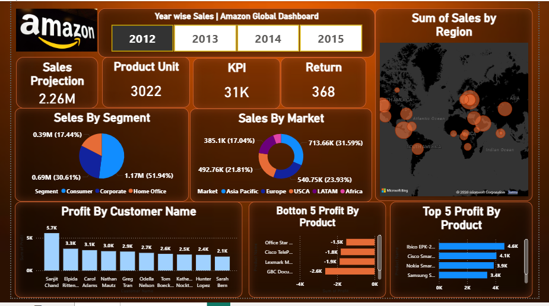
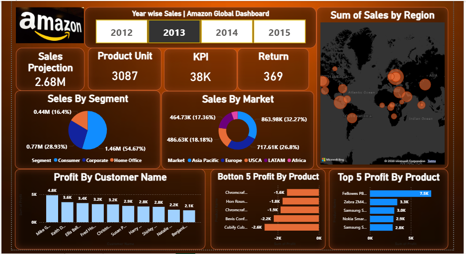
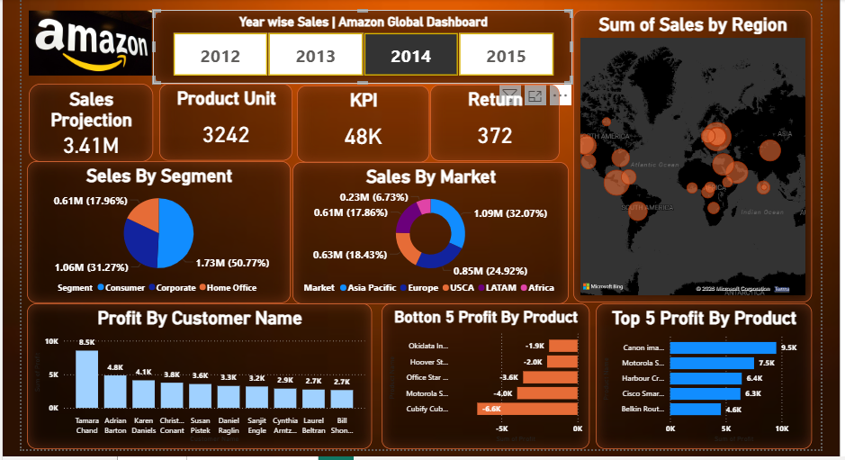
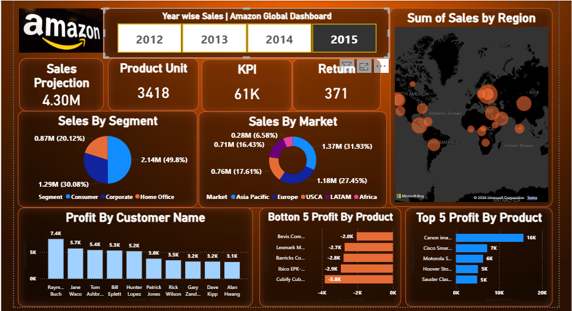

# 📊 Amazon Global Sales Dashboard — Power BI

An interactive Amazon Global Sales Dashboard developed using Microsoft Power BI to analyze sales performance, profitability, customers, products, markets, and regions.

## 📌 Project Overview

This project transforms global sales data into an interactive Business Intelligence dashboard.

The dashboard provides insights into sales trends, regional performance, customer profitability, product performance, returns, and key business KPIs.

## 🔍 Key Insights

- 📈 Year-wise Sales Analysis (2012–2015)
- 🌍 Region-wise Sales Distribution
- 🛍️ Sales by Segment & Market
- 📊 Sales Projection, Product Units & Returns
- 🏆 Top & Bottom Performing Products
- 👥 Customer-wise Profit Analysis

## 🛠️ Tools & Technologies

- Microsoft Power BI
- Power Query
- DAX
- Data Visualization
- Business Intelligence
- Data Cleaning & Transformation

## 📊 Dashboard Features

- Interactive KPI cards
- Year-wise sales analysis
- Region and market analysis
- Segment-wise performance
- Product performance analysis
- Customer profitability analysis
- Interactive filters and slicers
- Business performance visualization
## 📸 Dashboard Preview

### 📊 Dashboard Overview

### 📈 Sales Analytics

### 📋 Detailed Analysis

### 📊 Additional Dashboard View

## 🎯 Project Objective

The main objective of this project is to analyze Amazon global sales data and present meaningful business insights through an interactive Power BI dashboard.

## 📚 Skills Improved

- Data Visualization
- Dashboard Designing
- Power Query
- DAX
- Business Insights Analysis
- Data Cleaning
- Business Intelligence

## 🚀 Future Improvements

- Add advanced DAX measures
- Add profit margin analysis
- Add sales forecasting
- Add additional drill-through pages
- Publish the dashboard online

## 👨‍💻 Author

**SOAIB AKHTAR**

B.Tech Computer Science & Engineering  
Aspiring Data Analyst
